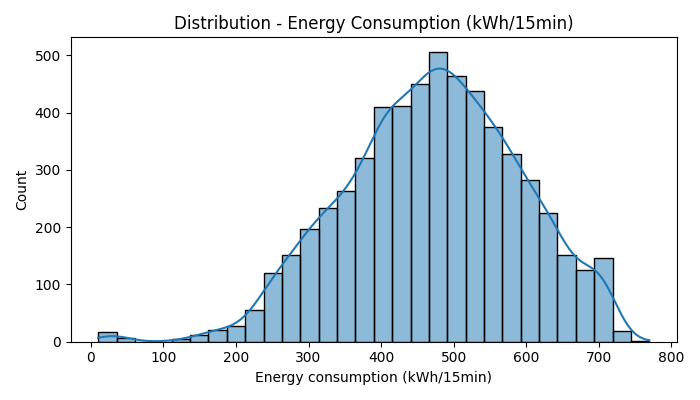
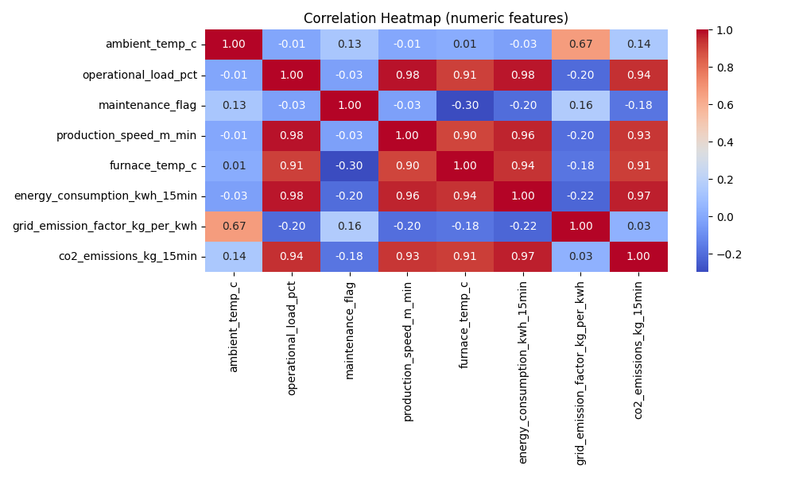
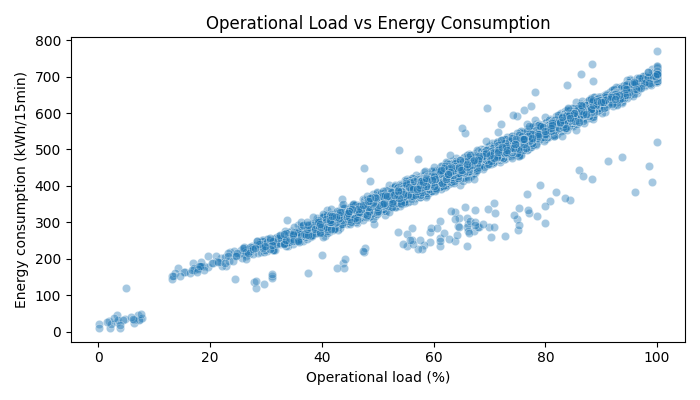
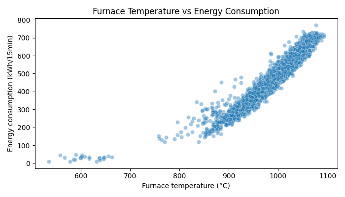
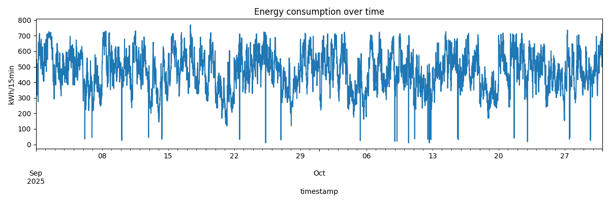
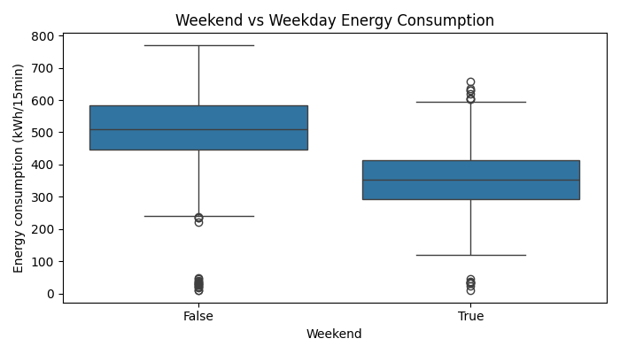

# ⚡ Optimisation Intelligente de la Consommation Énergétique d’une Ligne de Production

<p align="center">
  
  
  
  
  
  
</p>

---

## 📌 Executive Summary

Dans le secteur de la sidérurgie et de la métallurgie lourde, les lignes de production représentent des centres de coût énergétique massifs. Ce projet propose une **solution de bout en bout basée sur le Machine Learning** pour modéliser, prédire et optimiser la consommation électrique (en kWh par pas de 15 minutes) d'une ligne de laminage/traitement d'acier (**Steel Production Line**).

Grâce à l'analyse de signaux opérationnels continus (température du four, charge de travail, vitesse de défilement, régimes horaires), le modèle retenu (**Gradient Boosting Regressor**) atteint un coefficient de détermination **$R^2 = 98.74\%$** avec une erreur absolue moyenne (**MAE**) inférieure à **9.49 kWh / 15 min**.

---

## 🎯 Objectifs du Projet

1. **Cartographie Énergétique (EDA) :** Identifier les facteurs prépondérants de surconsommation et comprendre l'impact des cycles de charge et de repos.
2. **Pipeline de Prétraitement Robuste :** Nettoyage automatique, imputation, standardisation des variables physiques et encodage catégoriel sous forme de `Pipeline` scikit-learn réutilisable.
3. **Benchmarking Prédictif :** Évaluation comparative de modèles linéaires et ensemblistes (`Linear Regression`, `Random Forest`, `Gradient Boosting`).
4. **Optimisation & Inférence Industrielle :** Script d'inférence en temps réel pour tester de nouveaux scénarios de fonctionnement et cibler les plages de sobriété énergétique.

---

## 📊 Jeu de Données & Variables Clés

Le jeu de données contient des mesures échantillonnées toutes les 15 minutes décrivant l'état mécanique, thermique et temporel de l'installation :

| Variable | Type | Description |
| :--- | :--- | :--- |
| `timestamp` | Datetime | Horodatage de la mesure (échantillonnage 15 min) |
| `operational_load_pct` | Float (%) | Taux de charge opérationnelle de la ligne (0 à 100 %) |
| `furnace_temp_c` | Float (°C) | Température mesurée du four industriel |
| `production_speed_m_min` | Float (m/min)| Vitesse d'avancement de la matière première |
| `ambient_temp_c` | Float (°C) | Température de l'environnement d'usine |
| `machine_state` | Categorical | État de fonctionnement (`Normal`, `Idle`, `Maintenance`) |
| `shift` | Categorical | Quart de travail (`Day`, `Night`, `Evening`) |
| `weekday` / `weekend` | Boolean / String | Calendrier d'activité |
| **`energy_consumption_kwh_15min`** | **Target (kWh)** | **Consommation énergétique totale sur 15 min** |
| `co2_emissions_kg_15min` | Float (kg) | Empreinte carbone équivalente associée |

---

## 🔍 Analyses Exploratoires & Visualisations (EDA)

Toutes les visualisations issues de `01_eda.py` confirment des tendances physiques nettes :

<div align="center">

| Distribution de la Consommation | Matrice de Corrélation |
| :---: | :---: |
|  |  |
| *Distribution bimodale reflétant les phases de veille vs plein régime.* | *Forte corrélation positive entre charge opérationnelle, température four et consommation.* |

| Charge Opérationnelle vs Énergie | Température Four vs Énergie |
| :---: | :---: |
|  |  |
| *Relation quasi-linéaire avec dispersion accrue aux charges élevées.* | *Seuil d'activation thermique net augmentant la sollicitation réseau.* |

| Consommation dans le Temps | Impact Semaine vs Week-end |
| :---: | :---: |
|  |  |
| *Variations cycliques et détection de baisses d'activité périodiques.* | *Écarts substantiels de charge médiane entre jours ouvrés et week-ends.* |

</div>

---

## 🏆 Résultats & Benchmarking des Modèles

L'évaluation a été réalisée sur un jeu de test indépendant (20 % du volume total, validation reproductible) avec les métriques **MAE** (Mean Absolute Error), **RMSE** (Root Mean Squared Error) et **$R^2$** :

| Modèle | MAE (kWh / 15min) | RMSE (kWh / 15min) | Score $R^2$ | Statut |
| :--- | :---: | :---: | :---: | :---: |
| 🥇 **Gradient Boosting Regressor** | **9.49** | **13.68** | **0.9874 (98.7%)** | **Sélectionné & Sauvegardé** |
| 🥈 **Random Forest Regressor** | 9.54 | 14.84 | 0.9852 (98.5%) | Challenger robuste |
| 🥉 **Linear Regression** | 10.76 | 15.37 | 0.9842 (98.4%) | Ligne de base |

> 💡 **Observation :** Le **Gradient Boosting** offre la meilleure résilience face aux non-linéarités thermiques et aux transitions d'états machine (`Idle` vers `Normal`). Le modèle entraîné est sérialisé dans `models/best_model_GradientBoosting.joblib`.

---

## 🛠️ Architecture du Dépôt

```bash
optimisation-intelligente-consommation-energetique-ligne-production/
│
├── assets/                                     # Graphiques et visualisations EDA
│   ├── correlation_heatmap.png
│   ├── energy_distribution.png
│   ├── energy_over_time.png
│   ├── furnace_temp_vs_energy.png
│   ├── operational_load_vs_energy.png
│   └── weekend_vs_weekday.png
│
├── energy_ml_project/                          # Répertoire source du pipeline ML
│   ├── data/
│   │   └── steel_line_energy_dataset.csv       # Dataset haute résolution (15 min)
│   ├── models/
│   │   └── best_model_GradientBoosting.joblib  # Modèle final sérialisé
│   ├── 01_eda.py                               # Script d'analyse exploratoire complète
│   ├── 02_preprocessing.py                     # Pipeline Sklearn, imputation, splits
│   ├── 03_modeling.py                          # Entraînement, benchmarking & export
│   └── 04_prediction_and_optimization.py       # Simulation et inférence prédictive
│
├── .gitignore                                  # Exclusion des caches et gros artefacts
├── LICENSE                                     # Licence MIT
├── README.md                                   # Documentation détaillée
└── requirements.txt                            # Spécification des dépendances Python
```

---

## 🚀 Démarrage Rapide

### 1. Cloner le Dépôt
```bash
git clone https://github.com/Nouary/optimisation-intelligente-consommation-energetique-ligne-production.git
cd optimisation-intelligente-consommation-energetique-ligne-production
```

### 2. Configurer l'Environnement Virtuel
```bash
# Création de l'environnement virtuel
python -m venv .venv

# Activation (Windows PowerShell)
.\.venv\Scripts\Activate.ps1

# Activation (Linux / macOS)
source .venv/bin/activate

# Installation des dépendances
pip install -r requirements.txt
```

### 3. Exécuter le Pipeline de Machine Learning

```powershell
# 1. Lancer l'analyse exploratoire (génération des statistiques et aperçus)
python energy_ml_project/01_eda.py

# 2. Vérifier le pipeline de prétraitement
python energy_ml_project/02_preprocessing.py

# 3. Entraîner et comparer les modèles (sauvegarde automatique du meilleur modèle)
python energy_ml_project/03_modeling.py

# 4. Exécuter une inférence avec le modèle sauvegardé
python energy_ml_project/04_prediction_and_optimization.py
```

### 4. Exemple d'Inférence Python

```python
import joblib
import pandas as pd

# Charger le modèle de production
model = joblib.load("energy_ml_project/models/best_model_GradientBoosting.joblib")

# Définir les paramètres d'exploitation en temps réel
sample = pd.DataFrame([{
    "weekday": "Monday",
    "weekend": False,
    "shift": "Day",
    "ambient_temp_c": 21.5,
    "operational_load_pct": 80.0,
    "machine_state": "Normal",
    "maintenance_flag": 0,
    "production_speed_m_min": 4.8,
    "furnace_temp_c": 1045,
    "grid_emission_factor_kg_per_kwh": 0.55,
    "hour": 14,
    "dayofweek": 0,
    "month": 9
}])

# Prédiction
conso_predite = model.predict(sample)[0]
print(f"Consommation estimée : {conso_predite:.2f} kWh / 15 min")
```

---

## ⚙️ Perspectives d'Amélioration & Industrie 4.0

- [ ] **Déploiement API REST / FastAPI :** Microservice conteneurisé (Docker) pour l'inférence temps réel connectée aux automates SCADA / PLC.
- [ ] **Optimisation Sous Contraintes (SLSQP / Algorithmes Génétiques) :** Détermination dynamique de la vitesse optimale et de la consigne thermique minimisant le coût énergétique sous contrainte de quota de production.
- [ ] **Intégration d'un Tableau de Bord Streamlit / Grafana :** Supervision en direct des écarts entre consommation réelle et prédiction du modèle (détection d'anomalies).

---

## 📜 Licence

Ce projet est sous licence **MIT**. Vous êtes libre de l'utiliser, l'adapter et le redistribuer en conservant la mention de copyright originale. Consultez le fichier [LICENSE](LICENSE) pour plus de détails.

---

## 👨‍💻 Auteur

**Nouary Lhoussaine**  
*Ingénieur Énergétique & Data Science / Machine Learning*  
- GitHub : [@Nouary](https://github.com/Nouary)  
